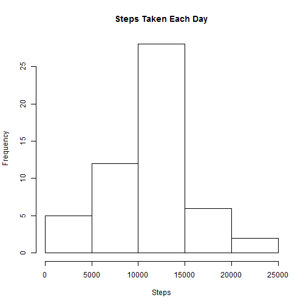
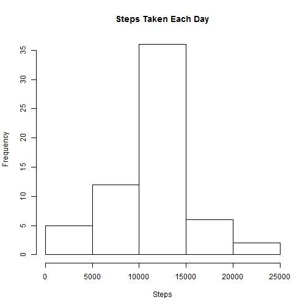
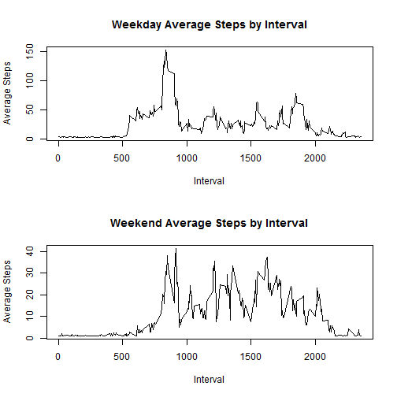

# Reproducible Research: Peer Assessment 1


## Loading and preprocessing the data

Link to data: https://d396qusza40orc.cloudfront.net/repdata%2Fdata%2Factivity.zip.  

Reading activity.csv:


```r
dat <- read.csv("activity.csv")
```


## What is mean total number of steps taken per day?

Calculating the total number of steps taken per day:  


```r
clean <- na.omit(dat) 
days <- unique(clean$date)
daily <- c()
for (i in 1:length(days)) {
        daily <- append(daily,sum(subset(clean, clean$date == days[i])$steps))
}

hist(daily, main="Steps Taken Each Day", xlab="Steps")
```



Calculating and reporting the mean and median of the total number of steps taken per day:


```r
stepsMean <- mean(daily)
stepsMedian <- median(daily)
stepsMean
```

```
## [1] 10766.19
```

```r
stepsMedian
```

```
## [1] 10765
```


## What is the average daily activity pattern?

Average number of steps by 5-minute interval over the entire two months:  


```r
fiveMins <- split(clean, clean$interval)
val <- c()
mx <- c()

for (i in 1:length(unique(clean$interval))) {
        val <- append(val,sum(fiveMins[[i]]["steps"])/(length(days)))
        if (max(val) == sum(fiveMins[[i]]["steps"])/(length(days))) {
                mx <- unique(clean$interval)[i]
        }
}

plot(unique(clean$interval), val, type="l", xlab="Interval", ylab="Average Steps", main="Average Steps by Interval")
```


The interval with the highest average number of steps taken can be found using the *mx* variable above and is displayed below, as well as its value, which is found via the *var* variable above:


```r
mx
```

```
## [1] 835
```

```r
max(val)
```

```
## [1] 206.1698
```


## Imputing missing values
This data set has several missing values, denoted by "NA."  The number of such instances can be found easily by subtracting the *clean* data set above from the full data set (*dat* in the code above).  


```r
nrow(dat) - nrow(clean)
```

```
## [1] 2304
```


So, there are 2,304 intervals in which the individual does not have data on the number of steps taken. 

To get a complete set of data, "NA" entries will be replaced with the average steps taken value across the entire *clean* data set.  This will be done in a new data set, named *complete*.  A histogram of steps taken each day with this new data set, as well as its **mean** and **median** are all displayed below. 


```r
complete <- dat

for (i in 1:nrow(complete)) {
        if (is.na(complete$steps[i])) {
                complete$steps[i] = mean(clean$steps)
}
}
 
allDays <- unique(complete$date)
fullDaily <- c()
for (i in 1:length(allDays)) {
        fullDaily <- append(fullDaily,sum(subset(complete, complete$date == allDays[i])$steps))
}

hist(fullDaily, main="Steps Taken Each Day", xlab="Steps")
```



```r
stepsCompleteMean <- mean(fullDaily)
stepsCompleteMedian <- median(fullDaily)
stepsCompleteMean
```

```
## [1] 10766.19
```

```r
stepsCompleteMedian
```

```
## [1] 10766.19
```

The **mean** and **median** are virtually the same as they were for the data set that omitted "NA" values.  This is because the "NA" values were replaced by the *clean* data set's average value, which of course would not alter the overall average.  The one noticeable change occurs in the histogram, where the most frequent range of daily steps taken increased in frequency.  This is due to the days with "NA" values being assigned the mean, pushing that range higher.  

## Are there differences in activity patterns between weekdays and weekends?

```r
dayType <- c()
for (i in 1:nrow(complete)) {
        if (weekdays(as.Date(complete[i,"date"])) =="Saturday" | weekdays(as.Date(complete[i,"date"])) == "Sunday") {
                dayType <- append(dayType, "weekend")
        }
        else {
                dayType <- append(dayType, "weekday")
        }
}

completeWeekType <- cbind(complete,dayType)

par(mfrow=c(2,1))
wday <- subset(completeWeekType, completeWeekType$dayType == "weekday")
wend <- subset(completeWeekType, completeWeekType$dayType == "weekend")
wdayInt <- split(wday, wday$interval)
u <- c()

for (i in 1:length(unique(wday$interval))) {
        u <- append(u,sum(wdayInt[[i]]["steps"])/(length(allDays)))
}

plot(unique(wday$interval), u, type="l", xlab="Interval", ylab="Average Steps", main="Weekday Average Steps by Interval")

wendInt <- split(wend, wend$interval)
v <- c()

for (i in 1:length(unique(wend$interval))) {
        v <- append(v,sum(wendInt[[i]]["steps"])/(length(allDays)))
}

plot(unique(wend$interval), v, type="l", xlab="Interval", ylab="Average Steps", main="Weekend Average Steps by Interval")
```



